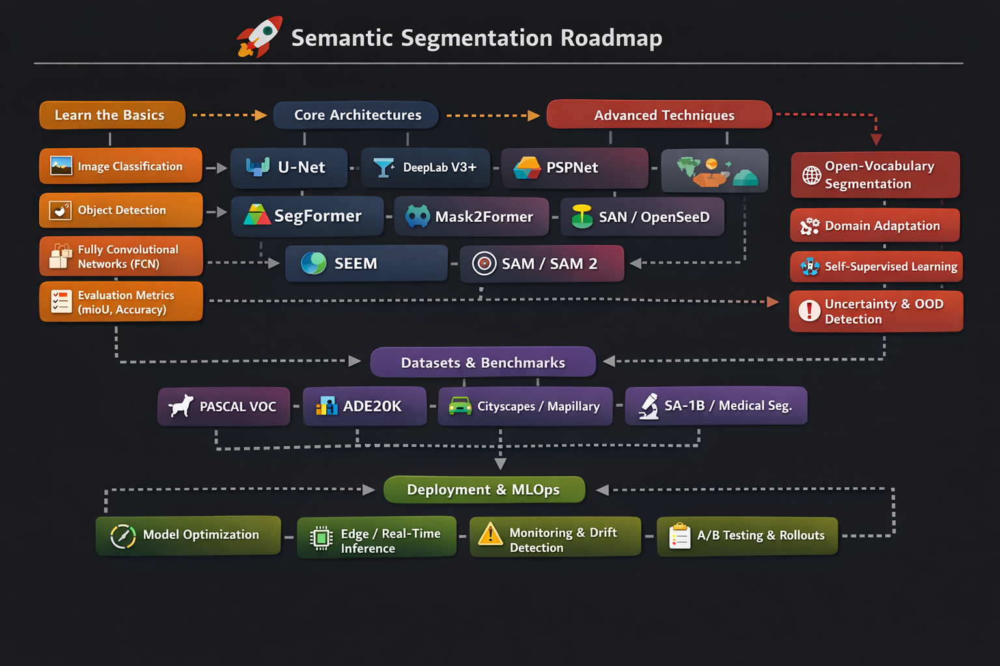

# Awesome Semantic Segmentation (Updated through 2026)

> ## A curated list of useful resources around semantic segmentation :tada:
> **Last updated:** April 2026

Semantic segmentation is a **computer vision task in which every pixel is assigned a semantic label**. It answers the question:

> *What is in this image, and where is it located at the pixel level?*

It is a core building block in autonomous driving, robotics, remote sensing, medical imaging, AR/VR, industrial inspection, document understanding, geospatial analysis, and embodied AI.

Modern semantic segmentation has evolved from **fully convolutional networks (FCNs)** to **multi-scale CNNs**, **high-resolution CNNs**, **hybrid CNN/Transformer models**, **mask-classification frameworks**, and more recently **foundation / promptable / open-vocabulary segmentation models**.

A few practical notes for 2026:

- **mIoU** is still the main benchmark metric, but **Dice/F1**, **boundary F-score**, **latency/FPS**, **memory**, **calibration**, and **out-of-domain robustness** matter in real systems.
- The field is no longer centered only on **PASCAL VOC 2012**. Common modern benchmarks include **ADE20K**, **Cityscapes**, **COCO-Stuff**, **Mapillary Vistas**, **BDD100K**, **LoveDA**, and domain-specific medical / remote-sensing datasets.
- Recent research increasingly overlaps with **instance segmentation**, **panoptic segmentation**, **open-vocabulary segmentation**, **interactive segmentation**, and **video segmentation**.

Useful leaderboard / trend trackers:
- [Papers with Code: Semantic Segmentation](https://paperswithcode.com/task/semantic-segmentation)
- [Cityscapes Benchmark Suite](https://www.cityscapes-dataset.com/benchmarks/)
- [MIT Scene Parsing Benchmark / ADE20K](https://ade20k.csail.mit.edu/)

Evaluate with: **mIoU**, pixel accuracy, Dice/F1, boundary quality, speed (FPS / latency), memory footprint, calibration, and robustness to domain shift / corruption.

---

## How to read this list

### Priority legend
- **S-tier**: must-read / must-know papers for most readers
- **A-tier**: strong follow-up papers that shape modern practice
- **B-tier**: specialized but valuable once you know the basics

### Suggested reading order
- **Read first**: foundational papers or the best entry points
- **Read next**: important improvements or modern replacements
- **Read later**: specialized directions such as open-vocabulary, continual, domain generalization, or promptable segmentation

---

## Recommended reading order (start here)

| Order | Priority | Read this first if you want... | Paper / resource | Why it matters |
|---|---|---|---|---|
| 1 | S-tier | the historical starting point | [FCN (2015)](https://arxiv.org/abs/1411.4038) | Canonical dense-prediction baseline |
| 2 | S-tier | biomedical / encoder-decoder intuition | [U-Net (2015)](https://arxiv.org/abs/1505.04597) | Skip-connection encoder-decoder template still used everywhere |
| 3 | S-tier | multi-scale context | [PSPNet (2017)](https://arxiv.org/abs/1612.01105) | Introduced a very influential pyramid-context design |
| 4 | S-tier | strong CNN-era production baseline | [DeepLabV3 / DeepLabV3+ (2017/2018)](https://arxiv.org/abs/1706.05587), [V3+](https://arxiv.org/abs/1802.02611) | Atrous convolution + ASPP remain core concepts |
| 5 | A-tier | high-resolution features | [HRNet (2019)](https://arxiv.org/abs/1908.07919), [OCR (2020)](https://arxiv.org/abs/1909.11065) | Strong baseline family for semantic segmentation |
| 6 | S-tier | first modern Transformer segmentation model to really know | [SegFormer (2021)](https://arxiv.org/abs/2105.15203) | Excellent accuracy/efficiency trade-off; easy entry to Transformer-based segmentation |
| 7 | S-tier | universal segmentation / mask-classification view | [Mask2Former (2022)](https://arxiv.org/abs/2112.01527) | Unified semantic / instance / panoptic segmentation |
| 8 | A-tier | train-once multi-task segmentation | [OneFormer (2023)](https://arxiv.org/abs/2211.06220) | Important universal segmentation direction |
| 9 | A-tier | open-vocabulary segmentation | [SAN (2023)](https://arxiv.org/abs/2302.12242), [OpenSeeD (2023)](https://arxiv.org/abs/2303.08131) | Connects segmentation to CLIP and language supervision |
| 10 | S-tier | promptable / foundation segmentation | [SAM (2023)](https://arxiv.org/abs/2304.02643) | Huge impact on annotation workflows and segmentation tooling |
| 11 | A-tier | promptable segmentation beyond still images | [SAM 2 (2024)](https://arxiv.org/abs/2408.00714) | Extends promptable segmentation to image + video |
| 12 | B-tier | “one model for many segmentation tasks” | [OMG-Seg (2024)](https://arxiv.org/abs/2401.10229) | Good map of the universal / all-in-one direction |

---

## Timeline / breakthroughs of semantic segmentation

> This section is meant to answer: **what really changed in each era, and why did it matter?** If you are new to the field, read the rows from top to bottom before diving into the larger paper list.

### Key inflection points to remember

- **FCN (2014/2015)** turned segmentation into **end-to-end dense prediction**, replacing hand-crafted pipelines with a single trainable network.
- **U-Net (2015)** made **encoder-decoder + skip connections** the default mental model for segmentation, especially when localization matters.
- **DeepLab / PSPNet (2016-2018)** established the importance of **multi-scale context, atrous convolution, and sharper boundaries**.
- **ENet / ICNet / BiSeNet (2016-2019)** made it clear that **latency and memory** are first-class constraints, not afterthoughts.
- **SETR / Segmenter / SegFormer (2020-2021)** marked the **Transformer transition**, bringing stronger global context modeling.
- **MaskFormer / Mask2Former / OneFormer (2021-2023)** reframed segmentation from per-pixel classification to **mask classification / universal segmentation**.
- **SAM / SAM 2 (2023-2024)** shifted the field toward **promptable foundation segmentation**, massively affecting annotation workflows and zero-shot use cases.
- **SAM 3 and concept-driven segmentation (2025-2026)** push the frontier toward **language / concept-conditioned segmentation across images and video**, though this is still newer and less standardized than FCN→DeepLab→SegFormer style baselines.

### Timeline of major breakthroughs

| Era | Breakthrough | Representative papers / projects | What changed technically | Why it mattered | Priority | Read after |
|---|---|---|---|---|---|---|
| 2014-2015 | End-to-end dense prediction | [FCN](https://arxiv.org/abs/1411.4038) | Converted classification CNNs into fully convolutional dense predictors with upsampling and skip fusion | This is the canonical starting point of modern semantic segmentation | S-tier | read first |
| 2015 | Encoder-decoder with skip connections becomes a template | [U-Net](https://arxiv.org/abs/1505.04597) | Symmetric contracting/expanding path with skip connections for precise localization | Became the dominant template for medical, industrial, and many small-data segmentation settings | S-tier | FCN |
| 2016-2018 | Multi-scale context and boundary refinement | [DeepLab](https://arxiv.org/abs/1606.00915), [DeepLabV3](https://arxiv.org/abs/1706.05587), [DeepLabV3+](https://arxiv.org/abs/1802.02611), [PSPNet](https://arxiv.org/abs/1612.01105) | Atrous convolution, ASPP, pyramid pooling, encoder-decoder refinement | Defined the strongest CNN-era recipe and many concepts still reused today | S-tier | FCN, U-Net |
| 2016-2019 | Real-time segmentation becomes a serious subfield | [ENet](https://arxiv.org/abs/1606.02147), [ICNet](https://arxiv.org/abs/1704.08545), [BiSeNet](https://arxiv.org/abs/1808.00897) | Lightweight backbones, multi-branch designs, explicit speed/accuracy trade-offs | Critical for robotics, autonomous driving, mobile, and embedded deployment | A-tier | DeepLab / PSPNet intuition |
| 2019-2020 | High-resolution reasoning and stronger object context | [HRNet](https://arxiv.org/abs/1908.07919), [OCR](https://arxiv.org/abs/1909.11065) | Maintained high-resolution streams and refined predictions with object-context modeling | Improved fine structures and thin-object segmentation; very strong practical baselines | A-tier | DeepLabV3+ |
| 2020-2021 | Transformer-based segmentation arrives | [SETR](https://arxiv.org/abs/2012.15840), [Segmenter](https://arxiv.org/abs/2105.05633), [SegFormer](https://arxiv.org/abs/2105.15203) | Global self-attention, patch/token representations, then more efficient hierarchical Transformer encoders | Marked the transition from CNN-dominant design to Transformer-era segmentation | S-tier | CNN-era baselines |
| 2021-2023 | Segmentation is reframed as mask classification / universal segmentation | [MaskFormer](https://arxiv.org/abs/2107.06278), [Mask2Former](https://arxiv.org/abs/2112.01527), [OneFormer](https://arxiv.org/abs/2211.06220) | Predicts sets of masks + labels instead of only per-pixel logits; unifies semantic / instance / panoptic tasks | One of the most important conceptual shifts after FCN and DeepLab | S-tier | SegFormer / Transformer basics |
| 2023-2024 | Promptable foundation segmentation | [SAM](https://arxiv.org/abs/2304.02643), [SEEM](https://arxiv.org/abs/2304.06718), [SAM 2](https://arxiv.org/abs/2408.00714) | Large-scale prompt-conditioned mask prediction; points, boxes, masks, text/image prompts; extension to video memory | Changed annotation tooling, zero-shot segmentation, and human-in-the-loop data engines | S-tier | Mask2Former, open-vocabulary basics |
| 2023-2024 | Open-vocabulary and vision-language segmentation | [SAN](https://arxiv.org/abs/2302.12242), [OpenSeeD](https://arxiv.org/abs/2303.08131), [OMG-Seg](https://arxiv.org/abs/2401.10229) | Connects CLIP-style semantics and universal segmentation with open-world categories | Important if you care about segmentation beyond fixed label sets | A-tier | SAM or Mask2Former |
| 2025-2026 | Concept-conditioned promptable segmentation frontier | [SAM 3](https://arxiv.org/abs/2511.16719) | Moves from geometry prompts to concept prompts (noun phrases, exemplars, tracking identities across image/video) | Likely points toward the next phase of segmentation, but still a frontier direction rather than the default baseline stack | B-tier | SAM / SAM 2 |

### A compact reading path by era

1. **History and core intuition**: [FCN](https://arxiv.org/abs/1411.4038) → [U-Net](https://arxiv.org/abs/1505.04597) → [PSPNet](https://arxiv.org/abs/1612.01105) → [DeepLabV3+](https://arxiv.org/abs/1802.02611)
2. **Deployment and strong practical baselines**: [BiSeNet](https://arxiv.org/abs/1808.00897) → [HRNet](https://arxiv.org/abs/1908.07919) → [OCR](https://arxiv.org/abs/1909.11065)
3. **Transformer era**: [SETR](https://arxiv.org/abs/2012.15840) → [SegFormer](https://arxiv.org/abs/2105.15203)
4. **Universal segmentation**: [MaskFormer](https://arxiv.org/abs/2107.06278) → [Mask2Former](https://arxiv.org/abs/2112.01527) → [OneFormer](https://arxiv.org/abs/2211.06220)
5. **Foundation / promptable / open-vocabulary frontier**: [SAM](https://arxiv.org/abs/2304.02643) → [SAM 2](https://arxiv.org/abs/2408.00714) → [SAN](https://arxiv.org/abs/2302.12242) / [OpenSeeD](https://arxiv.org/abs/2303.08131) → [SAM 3](https://arxiv.org/abs/2511.16719)

---

## State-of-the-art and milestone methods for semantic segmentation

> The exact top-ranked model changes frequently by benchmark and training recipe. The table below is intentionally curated around **representative milestone methods and 2021–2026 trends**, while keeping earlier classics for context.

| Method / architecture | Paper | Code / project | Best for | Priority | Read after |
|---|---|---|---|---|---|
| FCN | [Fully Convolutional Networks for Semantic Segmentation](https://arxiv.org/abs/1411.4038) | [Caffe](https://github.com/shelhamer/fcn.berkeleyvision.org) | historical baseline | S-tier | read first |
| U-Net | [U-Net: Convolutional Networks for Biomedical Image Segmentation](https://arxiv.org/abs/1505.04597) | [Official page](https://lmb.informatik.uni-freiburg.de/people/ronneber/u-net/) | medical segmentation, encoder-decoder intuition | S-tier | FCN |
| PSPNet | [Pyramid Scene Parsing Network](https://arxiv.org/abs/1612.01105) | [PyTorch](https://github.com/kazuto1011/pspnet-pytorch) | multi-scale context | S-tier | FCN, U-Net |
| DeepLabV3 | [Rethinking Atrous Convolution for Semantic Image Segmentation](https://arxiv.org/abs/1706.05587) | [TensorFlow](https://github.com/tensorflow/models/tree/master/research/deeplab) | strong CNN baseline | S-tier | PSPNet |
| DeepLabV3+ | [Encoder-Decoder with Atrous Separable Convolution for Semantic Image Segmentation](https://arxiv.org/abs/1802.02611) | [TensorFlow](https://github.com/tensorflow/models/tree/master/research/deeplab), [PyTorch](https://github.com/jfzhang95/pytorch-deeplab-xception) | still-strong practical baseline | S-tier | DeepLabV3 |
| HRNet | [Deep High-Resolution Representation Learning for Visual Recognition](https://arxiv.org/abs/1908.07919) | [HRNet](https://github.com/HRNet/HRNet-Semantic-Segmentation) | keeping high-resolution features | A-tier | DeepLabV3+ |
| OCR | [Object-Contextual Representations for Semantic Segmentation](https://arxiv.org/abs/1909.11065) | [HRNet + OCR code](https://github.com/HRNet/HRNet-Semantic-Segmentation) | context refinement | A-tier | HRNet |
| SegFormer | [SegFormer: Simple and Efficient Design for Semantic Segmentation with Transformers](https://arxiv.org/abs/2105.15203) | [NVLabs](https://github.com/NVlabs/SegFormer), [HF Transformers](https://huggingface.co/docs/transformers/model_doc/segformer) | lightweight modern Transformer baseline | S-tier | DeepLabV3+ or HRNet/OCR |
| Mask2Former | [Masked-attention Mask Transformer for Universal Image Segmentation](https://arxiv.org/abs/2112.01527) | [facebookresearch/Mask2Former](https://github.com/facebookresearch/Mask2Former) | semantic + instance + panoptic with one framework | S-tier | SegFormer |
| SegNeXt | [SegNeXt: Rethinking Convolutional Attention Design for Semantic Segmentation](https://arxiv.org/abs/2209.08575) | [Official code](https://github.com/Visual-Attention-Network/SegNeXt) | strong CNN-style efficiency/accuracy trade-off | A-tier | DeepLabV3+, SegFormer |
| InternImage | [InternImage: Exploring Large-Scale Vision Foundation Models with Deformable Convolutions](https://arxiv.org/abs/2211.05778) | [OpenGVLab/InternImage](https://github.com/OpenGVLab/InternImage) | strong large-scale backbone | B-tier | SegFormer |
| OneFormer | [OneFormer: One Transformer to Rule Universal Image Segmentation](https://arxiv.org/abs/2211.06220) | [SHI-Labs/OneFormer](https://github.com/SHI-Labs/OneFormer) | train-once universal segmentation | A-tier | Mask2Former |
| SAN | [Side Adapter Network for Open-Vocabulary Semantic Segmentation](https://arxiv.org/abs/2302.12242) | [MendelXu/SAN](https://github.com/MendelXu/SAN) | CLIP-based open-vocabulary segmentation | A-tier | SegFormer, Mask2Former |
| OpenSeeD | [A Simple Framework for Open-Vocabulary Segmentation and Detection](https://arxiv.org/abs/2303.08131) | [IDEA-Research/OpenSeeD](https://github.com/IDEA-Research/OpenSeeD) | open-vocabulary segmentation + detection | A-tier | SAN |
| SEEM | [Segment Everything Everywhere All at Once](https://arxiv.org/abs/2304.06718) | [UX-Decoder/SEEM](https://github.com/UX-Decoder/Segment-Everything-Everywhere-All-At-Once) | multimodal prompting (points / boxes / text / image) | A-tier | SAM |
| SAM | [Segment Anything](https://arxiv.org/abs/2304.02643) | [facebookresearch/segment-anything](https://github.com/facebookresearch/segment-anything), [Project page](https://segment-anything.com/) | annotation tooling, promptable segmentation | S-tier | SegFormer, Mask2Former |
| MaskDINO | [Mask DINO: Towards a Unified Transformer-Based Framework for Object Detection and Segmentation](https://arxiv.org/abs/2206.02777) | [IDEA-Research/MaskDINO](https://github.com/IDEA-Research/MaskDINO) | unified detection + segmentation | B-tier | Mask2Former |
| SAM 2 | [SAM 2: Segment Anything in Images and Videos](https://arxiv.org/abs/2408.00714) | [facebookresearch/sam2](https://github.com/facebookresearch/sam2) | promptable image + video segmentation | A-tier | SAM |
| OMG-Seg | [OMG-Seg: Is One Model Good Enough For All Segmentation?](https://arxiv.org/abs/2401.10229) | [lxtGH/OMG-Seg](https://github.com/lxtGH/OMG-Seg) | universal / all-in-one segmentation | B-tier | Mask2Former, OneFormer, SAM |

---

## Architecture families and real-time models

### Real-time / deployment-oriented architectures
| Model | Paper | Code / project | Notes | Priority |
|---|---|---|---|---|
| ENet | [ENet: A Deep Neural Network Architecture for Real-Time Semantic Segmentation](https://arxiv.org/abs/1606.02147) | [ENet code](https://github.com/e-lab/ENet-training) | classic lightweight baseline | B-tier |
| ICNet | [ICNet for Real-Time Semantic Segmentation on High-Resolution Images](https://arxiv.org/abs/1704.08545) | [hszhao/ICNet](https://github.com/hszhao/ICNet) | multi-resolution real-time design | B-tier |
| Fast-SCNN | [Fast-SCNN: Fast Semantic Segmentation Network](https://arxiv.org/abs/1902.04502) | [TensorFlow unofficial](https://github.com/Tramac/Fast-SCNN-pytorch) | edge/mobile-style segmentation | A-tier |
| BiSeNetV2 | [BiSeNet V2: Bilateral Network with Guided Aggregation for Real-time Semantic Segmentation](https://arxiv.org/abs/2004.02147) | [CoinCheung/BiSeNet](https://github.com/CoinCheung/BiSeNet) | strong real-time baseline | A-tier |
| DDRNet | [Deep Dual-resolution Networks for Real-time and Accurate Semantic Segmentation of Road Scenes](https://arxiv.org/abs/2101.06085) | [ydhongHIT/DDRNet](https://github.com/ydhongHIT/DDRNet) | popular for driving scenes | A-tier |
| PIDNet | [PIDNet: A Real-time Semantic Segmentation Network Inspired by PID Controllers](https://arxiv.org/abs/2206.02066) | [XuJiacong/PIDNet](https://github.com/XuJiacong/PIDNet) | very practical speed/accuracy trade-off | A-tier |
| PP-LiteSeg | [PP-LiteSeg: A Superior Real-Time Semantic Segmentation Model](https://arxiv.org/abs/2204.02681) | [PaddleSeg](https://github.com/PaddlePaddle/PaddleSeg) | practical deployment family | A-tier |

### Specialized directions
- **Medical segmentation:** [U-Net](https://arxiv.org/abs/1505.04597), [U-Net++](https://arxiv.org/abs/1807.10165), [Attention U-Net](https://arxiv.org/abs/1804.03999), [nnU-Net](https://arxiv.org/abs/1809.10486), [nnU-Net v2](https://github.com/MIC-DKFZ/nnUNet)
- **Remote sensing:** [LoveDA benchmark](https://github.com/Junjue-Wang/LoveDA), [iSAID](https://captain-whu.github.io/iSAID/index.html), SegFormer/Mask2Former/HRNet-based pipelines
- **Open-vocabulary segmentation:** [SAN](https://arxiv.org/abs/2302.12242), [OpenSeeD](https://arxiv.org/abs/2303.08131), [SEEM](https://arxiv.org/abs/2304.06718)
- **Promptable / interactive segmentation:** [SAM](https://arxiv.org/abs/2304.02643), [SAM 2](https://arxiv.org/abs/2408.00714), [SEEM](https://arxiv.org/abs/2304.06718)
- **Universal segmentation:** [Mask2Former](https://arxiv.org/abs/2112.01527), [OneFormer](https://arxiv.org/abs/2211.06220), [OMG-Seg](https://arxiv.org/abs/2401.10229)

---

## Research papers (curated reading list)

> This section is intentionally **paper-centric** rather than repo-centric. It is ordered to help you decide **what to read before / after**.

### 1) Foundational papers (read these first)
| Priority | Paper | Why read it |
|---|---|---|
| S-tier | [Fully Convolutional Networks for Semantic Segmentation (2015)](https://arxiv.org/abs/1411.4038) | Origin of modern fully-convolutional dense prediction |
| S-tier | [U-Net: Convolutional Networks for Biomedical Image Segmentation (2015)](https://arxiv.org/abs/1505.04597) | Canonical encoder-decoder with skip connections |
| S-tier | [Pyramid Scene Parsing Network (2017)](https://arxiv.org/abs/1612.01105) | Multi-scale context made practical |
| S-tier | [Rethinking Atrous Convolution for Semantic Image Segmentation (2017)](https://arxiv.org/abs/1706.05587) | Atrous convolution + ASPP became core concepts |
| S-tier | [Encoder-Decoder with Atrous Separable Convolution for Semantic Image Segmentation (2018)](https://arxiv.org/abs/1802.02611) | DeepLabV3+ remains one of the best baseline families |

### 2) Strong CNN-era follow-ups (read next)
| Priority | Paper | Why read it |
|---|---|---|
| A-tier | [Deep High-Resolution Representation Learning for Visual Recognition (2019)](https://arxiv.org/abs/1908.07919) | Helps explain why HRNet remains a strong segmentation backbone |
| A-tier | [Object-Contextual Representations for Semantic Segmentation (2020)](https://arxiv.org/abs/1909.11065) | Important context modeling upgrade on top of HRNet |
| A-tier | [BiSeNet V2 (2020)](https://arxiv.org/abs/2004.02147) | Useful if you care about real-time deployment |
| A-tier | [Deep Dual-resolution Networks for Real-time and Accurate Semantic Segmentation of Road Scenes (2021)](https://arxiv.org/abs/2101.06085) | Strong road-scene real-time family |
| A-tier | [PIDNet (2022)](https://arxiv.org/abs/2206.02066) | Excellent practical real-time follow-up |

### 3) Modern Transformer / universal segmentation papers
| Priority | Paper | Why read it |
|---|---|---|
| S-tier | [SegFormer (2021)](https://arxiv.org/abs/2105.15203) | Best starting point for Transformer-based semantic segmentation |
| S-tier | [Mask2Former (2022)](https://arxiv.org/abs/2112.01527) | Changes the viewpoint from per-pixel heads to mask classification |
| A-tier | [OneFormer (2023)](https://arxiv.org/abs/2211.06220) | Train-once universal segmentation framework |
| A-tier | [SegNeXt (2022)](https://arxiv.org/abs/2209.08575) | Strong “CNN still matters” counterpoint to Transformer-heavy methods |
| B-tier | [InternImage (2023)](https://arxiv.org/abs/2211.05778) | Large-scale backbone worth reading once you know the basics |

### 4) Open-vocabulary / foundation / promptable segmentation papers
| Priority | Paper | Why read it |
|---|---|---|
| A-tier | [Side Adapter Network for Open-Vocabulary Semantic Segmentation (2023)](https://arxiv.org/abs/2302.12242) | Strong entry point into CLIP-based open-vocabulary segmentation |
| A-tier | [A Simple Framework for Open-Vocabulary Segmentation and Detection (2023)](https://arxiv.org/abs/2303.08131) | Unifies segmentation and detection in open-vocabulary settings |
| A-tier | [Segment Everything Everywhere All at Once (2023)](https://arxiv.org/abs/2304.06718) | Useful for multimodal prompting and interactive setups |
| S-tier | [Segment Anything (2023)](https://arxiv.org/abs/2304.02643) | The foundation-model paper with the largest practical annotation impact |
| A-tier | [SAM 2: Segment Anything in Images and Videos (2024)](https://arxiv.org/abs/2408.00714) | Extends the SAM paradigm to streaming video |
| B-tier | [OMG-Seg: Is One Model Good Enough For All Segmentation? (2024)](https://arxiv.org/abs/2401.10229) | Very useful map of universal segmentation ambitions |

### 5) Specialized papers to read later
| Priority | Paper | Why read it |
|---|---|---|
| A-tier | [nnU-Net: Self-adapting Framework for U-Net-Based Medical Image Segmentation (2018)](https://arxiv.org/abs/1809.10486) | One of the most practical papers in medical segmentation |
| B-tier | [Semi-Supervised Semantic Segmentation Based on Pseudo-Labels: A Survey (2024)](https://arxiv.org/abs/2403.01909) | Good orientation for low-label regimes |
| B-tier | [A Survey on Continual Semantic Segmentation (2023)](https://arxiv.org/abs/2310.14277) | Useful after you understand standard supervised training |
| B-tier | [Domain Generalization for Semantic Segmentation: A Survey (2025)](https://arxiv.org/abs/2510.03540) | Important for robustness and deployment beyond IID settings |
| B-tier | [A Survey on Training-free Open-Vocabulary Semantic Segmentation (2025)](https://arxiv.org/abs/2505.22209) | Useful once you move from closed-set to open-vocabulary settings |

---

## Review list of semantic segmentation

### General reviews and surveys
- **2025** — [Domain Generalization for Semantic Segmentation: A Survey](https://arxiv.org/abs/2510.03540)
- **2025** — [A Survey on Training-free Open-Vocabulary Semantic Segmentation](https://arxiv.org/abs/2505.22209)
- **2024** — [Semi-Supervised Semantic Segmentation Based on Pseudo-Labels: A Survey](https://arxiv.org/abs/2403.01909)
- **2024** — [Image semantic segmentation of indoor scenes: A survey](https://www.sciencedirect.com/science/article/pii/S1077314224001838)
- **2024** — [Deep learning-based real-time semantic segmentation: a survey](https://www.cjig.cn/en/article/doi/10.11834/jig.230659/)
- **2024** — [Domain generalization for semantic segmentation: a survey](https://link.springer.com/article/10.1007/s10462-024-10817-z)
- **2023** — [A Survey on Continual Semantic Segmentation: Theory, Challenge, Method and Application](https://arxiv.org/abs/2310.14277)
- **2023** — [Few-Shot Semantic Segmentation: a review of methodologies and open challenges](https://arxiv.org/abs/2304.05832)

### Older but still useful references
- [A 2021 guide to Semantic Segmentation](https://nanonets.com/blog/image-segmentation-2022/)
- [Evolution of Image Segmentation using Deep Convolutional Neural Network: A Survey (2020)](https://arxiv.org/abs/2001.04074)
- [An overview of semantic image segmentation](https://www.jeremyjordan.me/semantic-segmentation/)
- [Recent progress in semantic image segmentation (2018)](https://arxiv.org/abs/1809.10198)
- [A Survey of Semantic Segmentation (2016)](https://arxiv.org/abs/1602.06541)
- [CS231n Lecture: Detection and Segmentation](https://cs231n.stanford.edu/slides/2017/cs231n_2017_lecture11.pdf)

---

## Case studies / competitions / practical references

### Autonomous driving and street-scene parsing
- [Cityscapes Benchmark Suite](https://www.cityscapes-dataset.com/benchmarks/)
- [Mapillary Vistas](https://www.mapillary.com/dataset/vistas)
- [BDD100K toolkit and tasks](https://github.com/bdd100k/bdd100k)

### Remote sensing / earth observation
- [LoveDA dataset and benchmark](https://github.com/Junjue-Wang/LoveDA)
- [iSAID dataset](https://captain-whu.github.io/iSAID/index.html)
- [DeepGlobe challenge](https://competitions.codalab.org/competitions/18468)

### Medical / biomedical segmentation
- [Medical Segmentation Decathlon](https://medicaldecathlon.com/)
- [MONAI Label](https://project-monai.github.io/label.html)
- [HuBMAP + HPA - Hacking the Human Body](https://www.kaggle.com/competitions/hubmap-organ-segmentation)
- [SenNet + HOA - Hacking the Human Vasculature in 3D](https://www.kaggle.com/competitions/blood-vessel-segmentation)

### Older competition write-ups that are still educational
- Dstl Satellite Imagery Competition, 3rd place winners: [Blog](http://blog.kaggle.com/2017/05/09/dstl-satellite-imagery-competition-3rd-place-winners-interview-vladimir-sergey/), [Code](https://github.com/ternaus/kaggle_dstl_submission)
- Carvana Image Masking Challenge, 1st place winners: [Blog](http://blog.kaggle.com/2017/12/22/carvana-image-masking-first-place-interview/), [Code](https://github.com/asanakoy/kaggle_carvana_segmentation)
- MICCAI 2017 Robotic Instrument Segmentation: [Code + explanation](https://github.com/ternaus/robot-surgery-segmentation)
- 2018 Data Science Bowl nuclei segmentation: [1st place](https://www.kaggle.com/c/data-science-bowl-2018/discussion/54741), [2nd](https://www.kaggle.com/c/data-science-bowl-2018/discussion/61170), [3rd](https://www.kaggle.com/c/data-science-bowl-2018/discussion/56393)
- Airbus Ship Detection Challenge: [4th place](https://www.kaggle.com/c/airbus-ship-detection/discussion/71667), [6th](https://www.kaggle.com/c/airbus-ship-detection/discussion/71782)
- Severstal Steel Defect Detection: [1st place](https://www.kaggle.com/c/severstal-steel-defect-detection/discussion/114254)

---

## Most used loss functions

### Core losses
- **Pixel-wise Cross Entropy / Soft Cross Entropy**  
  Standard multi-class supervised objective; often the default baseline.
- **Dice / Soft Dice loss**  
  Very common when class imbalance is severe; especially popular in medical segmentation.
- **Jaccard / IoU loss**  
  Directly aligns better with IoU-style evaluation objectives.
- **Focal loss**  
  Helps when easy negatives dominate or rare classes are hard to learn.
- **Lovasz-Softmax loss**  
  Optimizes a differentiable surrogate of the IoU / Jaccard objective.

### Common imbalance-aware or boundary-aware losses
- **Tversky loss / Focal Tversky loss**  
  Useful for highly imbalanced foreground-background settings.
- **Boundary loss / Surface loss / Boundary IoU-oriented objectives**  
  Helpful when contour quality matters (medical, lane, crack, document, remote sensing).
- **OHEM / Bootstrapped Cross Entropy**  
  Reweights optimization toward hard pixels.
- **Combo losses**  
  In practice, many strong systems use **CE + Dice**, **CE + Lovasz**, or **Dice + Focal**.

### Practical rule of thumb
- Start with **Cross Entropy** for clean balanced datasets.
- Try **CE + Dice** when foreground is sparse or small.
- Add **Lovasz** if the target metric is IoU-heavy.
- Add **boundary-aware terms** when shape/contour matters.
- Track per-class metrics, not only global mIoU.

---

## Datasets

### General-purpose scene parsing / street scenes
| Dataset | Official page / paper | Typical use | Notes | Priority |
|---|---|---|---|---|
| [PASCAL VOC 2012](http://host.robots.ox.ac.uk/pascal/VOC/) | [Benchmark page](http://host.robots.ox.ac.uk:8080/leaderboard/displaylb.php?challengeid=11&compid=6), [paper](https://link.springer.com/chapter/10.1007/978-1-4471-1724-4_14) | classical semantic segmentation benchmark | 20 foreground classes + background | S-tier |
| [ADE20K](https://ade20k.csail.mit.edu/) | [Scene parsing benchmark](https://groups.csail.mit.edu/vision/datasets/ADE20K/), [paper](https://arxiv.org/abs/1608.05442) | modern scene parsing | 150 semantic categories | S-tier |
| [COCO-Stuff](https://github.com/nightrome/cocostuff) | [paper](https://arxiv.org/abs/1612.03716) | stuff + thing dense labeling | common dense-prediction benchmark | A-tier |
| [Cityscapes](https://www.cityscapes-dataset.com/) | [benchmark](https://www.cityscapes-dataset.com/benchmarks/), [paper](https://arxiv.org/abs/1604.01685) | urban driving | standard road-scene benchmark | S-tier |
| [Mapillary Vistas](https://www.mapillary.com/dataset/vistas) | [paper](https://arxiv.org/abs/1807.10221) | global street-scene parsing | broader geography than Cityscapes | A-tier |
| [BDD100K](https://github.com/bdd100k/bdd100k) | [paper](https://arxiv.org/abs/1805.04687) | driving / multitask learning | 100K driving videos, many tasks | A-tier |

### Remote sensing / aerial imagery
| Dataset | Official page / paper | Typical use | Notes | Priority |
|---|---|---|---|---|
| [LoveDA](https://github.com/Junjue-Wang/LoveDA) | [dataset page](https://rsidea.whu.edu.cn/LoveDA.htm), [paper](https://arxiv.org/abs/2110.08733) | land-cover segmentation, domain adaptation | urban / rural domain shift | A-tier |
| [iSAID](https://captain-whu.github.io/iSAID/index.html) | [paper](https://arxiv.org/abs/1905.12886) | aerial scene understanding | instance-heavy aerial imagery | B-tier |
| [Semantic3D](http://www.semantic3d.net/) | [paper](https://arxiv.org/abs/1704.03847) | 3D point-cloud segmentation | large-scale outdoor point clouds | B-tier |
| [DeepGlobe Land Cover](https://competitions.codalab.org/competitions/18468) | [paper](https://arxiv.org/abs/1805.06561) | satellite image segmentation | remote-sensing benchmark | B-tier |

### Medical / foundation-scale / other useful datasets
| Dataset | Official page / paper | Typical use | Notes | Priority |
|---|---|---|---|---|
| [SA-1B](https://segment-anything.com/dataset/index.html) | [SAM paper](https://arxiv.org/abs/2304.02643) | large-scale mask pretraining / annotation | foundation-scale mask dataset | A-tier |
| [Medical Segmentation Decathlon](https://medicaldecathlon.com/) | [Nature paper](https://www.nature.com/articles/s41467-022-30695-9) | robust medical segmentation benchmarking | multi-task medical benchmark | S-tier |
| [CamVid](http://mi.eng.cam.ac.uk/research/projects/VideoRec/CamVid/) | [paper](https://ieeexplore.ieee.org/document/6126286) | classic driving segmentation | smaller / older but educational | B-tier |
| [PASCAL-Context](https://cs.stanford.edu/~roozbeh/pascal-context/) | [paper](https://arxiv.org/abs/1402.6620) | richer context labels on VOC | useful extended benchmark | B-tier |
| [Awesome segmentation & saliency datasets](https://github.com/lartpang/awesome-segmentation-saliency-dataset) | [repo](https://github.com/lartpang/awesome-segmentation-saliency-dataset) | dataset discovery | useful gateway list | B-tier |
| [Kaggle search: segmentation datasets](https://www.kaggle.com/search?q=segmentation+in%3Adatasets) | [Kaggle](https://www.kaggle.com/search?q=segmentation+in%3Adatasets) | practical dataset discovery | convenient but noisy | B-tier |

---

## Frameworks for segmentation

### General-purpose research / production frameworks
| Framework | Repo / docs | Notes | Priority |
|---|---|---|---|
| [MMSegmentation](https://github.com/open-mmlab/mmsegmentation) | [Docs](https://onedl-mmsegmentation.readthedocs.io/en/latest/) | strong PyTorch toolbox with many backbones, decoders, datasets, and configs | S-tier |
| [Detectron2](https://github.com/facebookresearch/detectron2) | [Docs](https://detectron2.readthedocs.io/) | widely used for semantic / instance / panoptic segmentation | S-tier |
| [PaddleSeg](https://github.com/PaddlePaddle/PaddleSeg) | [Docs](https://github.com/PaddlePaddle/PaddleSeg) | broad semantic / interactive / panoptic / matting support | A-tier |
| [Segmentation Models PyTorch](https://github.com/qubvel-org/segmentation_models.pytorch) | [Docs](https://smp.readthedocs.io/en/latest/) | convenient high-level API with many encoders/decoders | A-tier |
| [Hugging Face semantic segmentation docs](https://huggingface.co/docs/transformers/tasks/semantic_segmentation) | [Model docs](https://huggingface.co/docs/transformers/model_doc/segformer) | easy fine-tuning / inference for Transformer-based models | A-tier |

### Domain-specific frameworks
| Framework | Repo / docs | Notes | Priority |
|---|---|---|---|
| [nnU-Net](https://github.com/MIC-DKFZ/nnUNet) | [Paper](https://arxiv.org/abs/1809.10486) | self-configuring medical segmentation framework | S-tier |
| [MONAI Label](https://project-monai.github.io/label.html) | [GitHub](https://github.com/Project-MONAI/MONAILabel) | AI-assisted annotation / active-learning style workflow | A-tier |
| [CSAILVision/semantic-segmentation-pytorch](https://github.com/CSAILVision/semantic-segmentation-pytorch) | [repo](https://github.com/CSAILVision/semantic-segmentation-pytorch) | useful educational implementation | B-tier |
| [HRNet-Semantic-Segmentation](https://github.com/HRNet/HRNet-Semantic-Segmentation) | [repo](https://github.com/HRNet/HRNet-Semantic-Segmentation) | strong baseline implementation | A-tier |
| [NVIDIA/semantic-segmentation](https://github.com/NVIDIA/semantic-segmentation) | [repo](https://github.com/NVIDIA/semantic-segmentation) | practical training recipes for dense prediction | B-tier |

### Older but still educational frameworks / repos
- [Semantic Segmentation Suite](https://github.com/GeorgeSeif/Semantic-Segmentation-Suite)
- [divamgupta/image-segmentation-keras](https://github.com/divamgupta/image-segmentation-keras)
- [Tramac/awesome-semantic-segmentation-pytorch](https://github.com/Tramac/awesome-semantic-segmentation-pytorch)

---

## Related techniques

### Classical dense-prediction building blocks
- [Atrous / Dilated Convolution](https://arxiv.org/abs/1511.07122)
- [Transpose Convolution](https://towardsdatascience.com/up-sampling-with-transposed-convolution-9ae4f2df52d0)
- [Unpooling](https://towardsdatascience.com/review-deconvnet-unpooling-layer-semantic-segmentation-55cf8a6e380e)
- [A technical report on convolution arithmetic](https://github.com/vdumoulin/conv_arithmetic)
- [CRF for semantic segmentation](https://arxiv.org/abs/1502.03240)

### Modern directions (2021–2026)
- **Transformer backbones** and hierarchical vision transformers
- **Mask classification** instead of only per-pixel classification heads
- **Promptable segmentation** with points / boxes / text / scribbles / masks
- **Open-vocabulary segmentation** with vision-language pretraining (e.g. CLIP-based)
- **Foundation-model-assisted annotation** with SAM / SAM 2 / interactive labeling tools
- **Universal segmentation** across semantic / instance / panoptic / video tasks
- **Domain adaptation / domain generalization / test-time adaptation**
- **Semi-supervised, few-shot, continual, and active-learning segmentation**
- **Distillation, quantization, pruning, and edge deployment**
- **Multimodal dense prediction** using language, video, audio, and 3D cues

---

---

## Segmentation in production

Production segmentation is usually **more of a systems problem than an architecture problem**. A strong production system needs a stable **label contract**, reliable **data pipelines**, correct **pre/post-processing**, measurable **latency/cost/SLOs**, and a feedback loop for **hard-example mining and relabeling**. In many real deployments, a conservative baseline plus a strong data engine beats a fragile SOTA model.

### When segmentation is the right abstraction
| Need | Is segmentation a good fit? | Why |
|---|---|---|
| You need **pixel area, shape, or boundaries** | Yes | Typical examples: organs, roads, water, cracks, defects |
| You need only **coarse localization / counting** | Sometimes not | Detection may be cheaper and easier to maintain |
| You need **fine thin structures** (lane, vessel, crack) | Yes, but use boundary-aware metrics/losses | Global mIoU can hide bad contours |
| You need **open-world interactive masking** | Often use promptable segmentation first | Human-in-the-loop quality control is still important |
| You operate under **hard real-time edge constraints** | Yes, if carefully scoped | Use lightweight models, quantization, and strict latency budgets |

### Common production archetypes / serving patterns
| Pattern | Good for | Core idea | Main trade-off |
|---|---|---|---|
| **Offline batch tiling pipeline** | remote sensing, pathology, document parsing | tile huge images, overlap, stitch predictions, write masks/GeoTIFFs | seam artifacts, context loss |
| **Real-time edge segmentation** | driving, robotics, mobile AR, factory line vision | lightweight model + optimized runtime (TensorRT / ONNX / SDK) | latency and memory dominate model choice |
| **Detector -> segmenter cascade** | defects, lesions, small target search | detect ROI first, segment only candidate regions | upstream misses cap final recall |
| **Human-in-the-loop assistive segmentation** | medical imaging, annotation tools, expert QA | model proposes masks, human edits/approves | UX quality matters as much as raw model accuracy |
| **Foundation-model-assisted labeling** | low-label or changing ontology settings | use SAM/SAM 2 style prompting for pre-labeling, then QA/retrain | fast bootstrap, but semantic label noise is common |
| **Multimodal perception stack** | autonomous driving, robotics, 3D medical | combine RGB + depth/LiDAR/text/meta-data | calibration and data plumbing become critical |

### Core concepts and design patterns

- **Label contract / ontology design**  
  Decide early what each class means, which boundaries count, how occlusion is handled, and whether there is an **unknown / ignore** region. Production failures often start with inconsistent annotation policy rather than bad modeling.

- **Train-serve symmetry**  
  The exact resize policy, channel order, normalization, interpolation rule, tiling overlap, padding, and post-processing used in validation must match serving. Many production regressions are caused by mismatched preprocessing rather than model changes.

- **Resize vs tile vs ROI crop**  
  For very large inputs, image scaling alone often destroys small structures. In practice, teams often prefer **sliding-window / overlapping tiles** or a **coarse detector + high-res segmenter** cascade.

- **Post-processing is part of the model**  
  Morphology, connected-components filtering, hole filling, CRF-like refinement, topology fixes, temporal smoothing, and class-priority rules should be versioned and evaluated like model code.

- **Abstention / reject option**  
  In regulated or safety-sensitive settings, it is often better to emit **"needs review"** than a confident wrong mask. Confidence thresholds, uncertainty proxies, or disagreement-based review rules are useful.

- **Temporal and spatial consistency**  
  For video or robotics, frame-wise masks can flicker even when mIoU is high. Production systems often add temporal smoothing, tracking constraints, or map priors.

- **Data engine over architecture churn**  
  Hard-example mining, slice-based evaluation, relabeling loops, and drift review usually produce larger gains than repeatedly swapping architectures.

- **Two-speed system design**  
  A common pattern is: fast online model for serving, heavier model or human review offline for QA, relabeling, or dispute resolution.

### Metrics that matter in production
| Metric family | What to track | Why it matters |
|---|---|---|
| **Segmentation quality** | mIoU, Dice, per-class IoU, per-class recall | standard quality, but must be sliced |
| **Boundary quality** | Boundary F1, Hausdorff/surface distance, contour error | critical for medical, crack, lane, document tasks |
| **Small-object quality** | small-instance recall, tiny-mask F1, ROI recall | global averages often hide misses |
| **Calibration / reliability** | confidence histograms, abstain rate, error by confidence | needed for review routing and thresholding |
| **Operational** | p50/p95 latency, throughput, GPU memory, cold start, cost/image | determines deployability |
| **Business / domain** | miss rate, review time saved, area/volume error, false alarm rate | maps model quality to value and risk |
| **Robustness slices** | night/rain/fog/site/scanner/camera/product-line breakdown | domain shift almost always appears in slices first |

### Case studies and production playbooks

#### 1) Autonomous driving / robotics perception
**Representative references:** [BDD100K paper](https://arxiv.org/abs/1805.04687), [BDD100K dataset](https://bdd-data.berkeley.edu/), [TensorRT quick start](https://docs.nvidia.com/deeplearning/tensorrt/latest/getting-started/quick-start-guide.html), [Fast INT8 inference for autonomous vehicles](https://developer.nvidia.com/blog/fast-int8-inference-for-autonomous-vehicles-with-tensorrt-3/)

**Typical pattern**
- Use segmentation for **drivable area, free space, lanes, road edges, curbs, sidewalk, ego-lane context**, or as one component in a multitask perception stack.
- Prefer **real-time edge deployment** with lightweight architectures such as BiSeNet / PIDNet / DDRNet / light SegFormer variants.
- Optimize with **INT8 / TensorRT / accelerator-aware runtimes** and benchmark **p95 latency**, not only mean FPS.
- Add **temporal smoothing**, multi-frame voting, or tracking priors to reduce mask flicker.
- Keep a **fallback path** for safety-critical features when segmentation confidence is low.

**Main risks**
- Night / rain / fog / glare domain shift
- Weak rare-class recall (construction zones, debris, temporary markings)
- Calibration drift across cameras and firmware
- Benchmark-overfitting that does not transfer to real roads

**Good practice**
- Evaluate by **weather / time-of-day / geography slices**.
- Track **drivable-area false negative rate** and **lane-boundary quality**, not only mIoU.
- Treat segmentation as one sensor in a **redundant perception stack**, not the single source of truth.

#### 2) Medical imaging / clinical workflow
**Representative references:** [nnU-Net paper](https://www.nature.com/articles/s41592-020-01008-z), [nnU-Net repo](https://github.com/MIC-DKFZ/nnUNet), [nnU-Net Revisited](https://arxiv.org/abs/2404.09556), [MONAI Deploy App SDK](https://docs.monai.io/projects/monai-deploy-app-sdk/en/3.0.0/index.html), [MONAI segmentation deployment tutorial](https://docs.monai.io/projects/monai-deploy-app-sdk/en/0.4.0/getting_started/tutorials/05_full_tutorial.html), [MONAI Label](https://project-monai.github.io/label.html)

**Typical pattern**
- Start from **nnU-Net** or a strong U-Net-family baseline before trying more complex architectures.
- Build a pipeline around **DICOM ingestion, series selection, preprocessing, inference, visualization, human review, and result export**.
- Use **MONAI Deploy** or similar operator-based application packaging for end-to-end workflow assembly.
- In many clinics, the model is used as **decision support / contour proposal**, with radiologist or clinician review before final acceptance.

**Main risks**
- Scanner/site/protocol shift
- Wrong-but-plausible masks that look visually acceptable
- Leakage through patient-level split mistakes
- Missing provenance, audit trail, or versioning in regulated workflows

**Good practice**
- Split data by **patient / site / scanner**, not by slice only.
- Track **Dice plus boundary/surface metrics** when contour quality matters.
- Keep **human review gates**, audit logs, and model/data version metadata.
- Prefer robust baselines and rigorous validation before claiming architectural gains.

#### 3) Industrial inspection / manufacturing quality
**Representative references:** [NVIDIA TAO Toolkit](https://developer.nvidia.com/tao-toolkit), [TAO docs](https://docs.nvidia.com/tao/tao-toolkit/latest/index.html), [TAO defect-detection case study](https://developer.nvidia.com/blog/transforming-industrial-defect-detection-with-nvidia-tao-and-vision-ai-models/), [AWS edge defect detection example](https://aws.amazon.com/blogs/machine-learning/detect-industrial-defects-at-low-latency-with-computer-vision-at-the-edge-with-amazon-sagemaker-edge/)

**Typical pattern**
- Use segmentation for **scratch / crack / contamination / coating / wafer / surface defect localization** when exact affected area matters.
- Common deployments use **edge inference near the line** to avoid network latency and keep data local.
- A practical pipeline is often **golden-image / change-detection / anomaly screening -> semantic or instance segmentation -> rule-based decision**.
- Retraining is often needed per **camera, product family, lighting setup, and line condition**.

**Main risks**
- Very small defects relative to frame size
- Severe class imbalance and weak positive coverage
- Lighting / lens / fixture drift causing false positives
- False alarms that create scrap, rework, or manual review overhead

**Good practice**
- Design the optical setup and labeling policy together with the ML stack.
- Use **high-resolution ROI crops** or cascades for tiny defects.
- Track business metrics such as **missed-defect rate, false reject rate, and operator review time**.
- Plan for frequent **recalibration and data refresh** after line changes.

#### 4) Geospatial / earth observation segmentation
**Representative references:** [TorchGeo paper](https://www.microsoft.com/en-us/research/publication/torchgeo-deep-learning-with-geospatial-data/), [TorchGeo tutorial](https://www.microsoft.com/en-us/research/publication/advancing-earth-observation-through-machine-learning-a-torchgeo-tutorial/), [TorchGeo docs](https://torchgeo.readthedocs.io/en/latest/)

**Typical pattern**
- Tile very large rasters into overlapping windows, run inference, then **stitch masks back while preserving CRS / affine transform / GeoTIFF metadata**.
- Use segmentation for **land cover, water, building footprint, crop, burn scar, flood, or change-detection style tasks**.
- Combine model predictions with **geospatial post-processing**: smoothing, polygonization, topology checks, minimum-area thresholds.

**Main risks**
- Seasonal and regional domain shift
- Cloud / haze / snow / shadow artifacts
- Resolution mismatch across sensors
- Border artifacts from naive tiling

**Good practice**
- Benchmark several tile sizes and overlaps; this matters a lot.
- Keep geospatial metadata correct end-to-end.
- Monitor **per-region / per-season** performance, not just a global score.
- Expect post-processing and GIS integration to be part of the product, not an afterthought.

#### 5) Foundation-model-assisted annotation and segmentation ops
**Representative references:** [SAM paper](https://arxiv.org/abs/2304.02643), [SAM 2 paper](https://arxiv.org/abs/2408.00714), [SEEM](https://arxiv.org/abs/2304.06718), [OpenSeeD](https://arxiv.org/abs/2303.08131)

**Typical pattern**
- Use promptable models to accelerate **annotation, QA, bootstrapping, and interactive editing**.
- Convert prompt-generated masks into task-specific semantic classes through **human review, ontology mapping, and relabeling**.
- Distill the workflow into a **smaller task-specific production model** if latency, cost, or semantics are strict.

**Main risks**
- Beautiful masks with wrong semantics
- Inconsistent class mapping across annotators
- Hidden failure modes on transparent, thin, or ambiguous structures
- Overreliance on generic foundation models in high-stakes settings

**Good practice**
- Treat foundation models as **annotation accelerators or assistive systems**, not automatic truth.
- Measure the downstream impact on **label quality and review time**, not only mask appearance.
- Version prompts, ontologies, and QA rules just like model code.

### Practical patterns that work well

- **Baseline -> slice analysis -> data engine -> architecture swap later**  
  Start from a stable baseline (DeepLabV3+, HRNet/OCR, SegFormer, nnU-Net, Mask2Former depending on task). Improve data quality and slice performance before chasing new architectures.

- **Cascade for efficiency**  
  Use a cheap stage to find candidate regions and a higher-resolution segmenter only where needed.

- **Shadow mode before hard rollout**  
  Run the model silently next to the human or legacy system, compare decisions, and mine disagreements.

- **Human-review routing**  
  Send low-confidence, out-of-distribution, or policy-sensitive cases to manual review instead of forcing full automation.

- **Version everything**  
  Model weights, thresholds, tiling scheme, interpolation mode, label map, post-processing, prompt templates, calibration artifacts, and evaluation slices should all be versioned.

- **Online monitor + offline relabel loop**  
  Production success usually depends on quickly collecting failure cases and adding them back into the training set.

### Common failure modes / anti-patterns
- Optimizing only **global mIoU** and missing small-object or boundary failures
- Changing resize / crop policy in serving without revalidating
- Using the fanciest model while ignoring ontology ambiguity and label noise
- Treating post-processing as ad hoc code outside the evaluation loop
- Assuming foundation-model masks are semantically correct without QA
- Ignoring site / device / camera / scanner / weather slice breakdowns
- Measuring average FPS instead of **tail latency and memory pressure**
- Forgetting that in many domains the real target is **risk reduction, review efficiency, or area estimation accuracy**, not benchmark rank

### Quick checklist before rollout
- Is the **label contract** frozen and documented?
- Are train/validation/test splits correct for the domain (patient/site/device/time aware)?
- Do offline preprocessing and online preprocessing match exactly?
- Are there slice metrics for the likely drift axes?
- Is there an abstain / review path?
- Are thresholds, post-processing, and confidence rules versioned?
- Are p95 latency, memory, startup, and cost/image acceptable on target hardware?
- Is there a plan for hard-example mining, relabeling, and rollback?

### Production reading order
1. **Read first:** [nnU-Net](https://www.nature.com/articles/s41592-020-01008-z) — best example of strong baseline thinking and system-level rigor in medical segmentation.  
2. **Read first:** [TensorRT quick start](https://docs.nvidia.com/deeplearning/tensorrt/latest/getting-started/quick-start-guide.html) and [MMDeploy for MMSegmentation](https://mmdeploy.readthedocs.io/en/latest/04-supported-codebases/mmseg.html) — good entry point for practical GPU deployment.  
3. **Read early:** [MONAI Deploy App SDK](https://docs.monai.io/projects/monai-deploy-app-sdk/en/3.0.0/index.html) — good reference for packaging segmentation workflows, not just models.  
4. **Read early:** [TorchGeo tutorial](https://www.microsoft.com/en-us/research/publication/advancing-earth-observation-through-machine-learning-a-torchgeo-tutorial/) — useful example of segmentation on large geospatial data with output packaging.  
5. **Read after:** [TAO Toolkit](https://developer.nvidia.com/tao-toolkit) / [TAO docs](https://docs.nvidia.com/tao/tao-toolkit/latest/index.html) — strong practical reference for industrial/edge workflows.  
6. **Read after:** [SAM](https://arxiv.org/abs/2304.02643) and [SAM 2](https://arxiv.org/abs/2408.00714) — essential for annotation and assistive workflows, but do not confuse annotation productivity with fully solved production semantics.

## Notes for practitioners
- For a **robust baseline**, start with **DeepLabV3+**, **HRNet/OCR**, or **SegFormer**.
- For **semantic + instance + panoptic** with one family, try **Mask2Former** or **OneFormer**.
- For **open-vocabulary / text-guided segmentation**, inspect **SAN**, **OpenSeeD**, and **SEEM**.
- For **interactive annotation pipelines**, start from **SAM / SAM 2** plus human QA.
- For **medical imaging**, check **nnU-Net** and **MONAI / MONAI Label** first.
- For **real-time deployment**, benchmark **BiSeNetV2**, **PIDNet**, **DDRNet**, **PP-LiteSeg**, or light SegFormer variants.
- For **remote sensing**, test **SegFormer**, **HRNet/OCR**, or **Mask2Former** before designing more specialized models.
- For **research onboarding**, read in this order: **FCN -> U-Net -> PSPNet -> DeepLabV3+ -> HRNet/OCR -> SegFormer -> Mask2Former -> OneFormer / SAN / SAM**.

If I had to pick one, the hardest problem in segmentation today is open-world robust generalization: getting the model to produce pixel-accurate masks with the right semantics for objects it did not see during training, in domains it was not trained on, while remaining calibrated about uncertainty. That is the point where open-vocabulary segmentation, domain shift, annotation noise, long-tail classes, and safety all collide. Recent open-vocabulary work explicitly frames pixel-level image–text alignment as the bottleneck, and newer “vocabulary-free” work shows that even specifying the right class names is itself a hard problem in real scenes. Domain-generalization surveys also keep highlighting that segmentation systems break under unseen environments because training assumes i.i.d. data, which rarely holds in practice.

Why this is so hard: segmentation is not only “what is this object,” but also “where does it start and end, at pixel precision.” That makes annotation expensive and noisy, especially around thin structures, occlusions, fuzzy boundaries, and partially visible objects. Recent work on noisy annotations emphasizes that segmentation labels often contain incomplete masks, over-extended masks, and ambiguous boundaries even in manually labeled datasets. At the same time, semantic segmentation has a strong long-tail problem: common classes dominate, while rare classes and small objects get weak representations and are easy to miss.

In research, I would rank the hardest subproblems like this. First: robust open-world generalization. Second: reliable semantics for rare, unseen, or linguistically ambiguous categories. Third: precise boundaries under weak or noisy supervision. Fourth: trustworthy uncertainty estimation and OOD detection, especially in safety-critical domains such as driving. Recent robust-segmentation challenge results focus specifically on uncertainty under natural adversarial conditions, which is a strong signal that the field still treats reliability as unresolved rather than solved.

In production, the hardest part is usually a little different. It is often not squeezing out another 1–2 mIoU on a benchmark; it is keeping performance stable when the world changes: camera pipeline changes, lighting/weather changes, label policy drifts, new object types appear, and annotation quality varies. For video systems, an extra challenge is temporal consistency: per-frame segmentation may look good statically but flicker badly over time, and efficient video methods still have to trade off consistency, accuracy, and compute.

So the cleanest answer is: the hardest single problem in segmentation is to generalize correctly and reliably beyond the training distribution, at pixel precision, under ambiguous semantics and imperfect labels. Everything else—boundary quality, rare classes, open vocabulary, uncertainty, and deployment drift—is a manifestation of that core difficulty.

> ## Feel free to show your :heart: by giving a star :star:
> ## :gift: [Check Out the List of Contributors](CONTRIBUTORS.md) — _Feel free to add your details here!_
